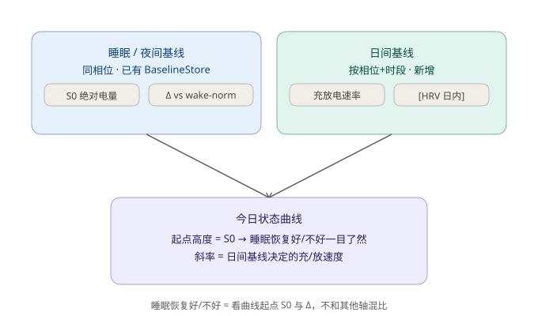
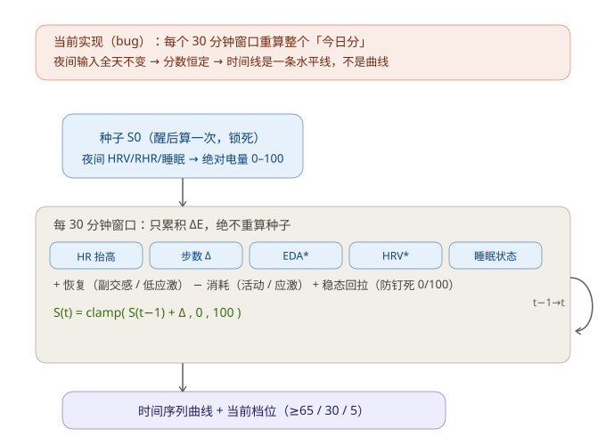

# 今日状态曲线算法工程 Spec（v2 · 累积能量模型）

> 版本：v2（2026-09-01）
> 状态：**设计评审中**，算法骨架已定，待确认问题见 §11
> 前置文档：`daily-status-algorithm-spec-v1.md`（本 Spec 取代其"日间修正"部分，保留其"相位专属基线系统"）

---

## 0. 变更摘要（相对 v1）

| 维度 | v1「每日总分模型」 | v2「每 30 分钟曲线模型」 |
|---|---|---|
| 输出 | 每天一个 0–100 分 | 每 30 分钟一个 0–100 电量，连续曲线 |
| 计算时机 | 醒后算一次，日间仅 ±15 微调 | 每个窗口独立累积 ΔE |
| 用户看到 | "今天 78 分" | 从醒到睡上下波动的曲线 + 最新点大数字 |
| 基线系统 | 相位专属基线（保留） | 相位专属基线（保留，仅复用为 S0 来源） |
| 新增 | — | 日间基线、wakeNorm、睡眠态强充电、稳态回拉 |

**核心结论**：算法输出从"每日一值"改为"每半小时一值"；计算方法从"锚点+微调"改为"起点的累积更新"。不推翻已有的相位专属基线系统，只替换"日间修正"的计算粒度与逻辑。

---

## 1. 产品目标与输出定义

「今日状态」页实时展示一条**精力/恢复电量曲线**（类似 Garmin Body Battery / WHOOP Day Strain），而非静态总分。

- **输出**：连续时间序列 `S(t)`，每 30 分钟一个值，单位 0–100（= 当前时刻的实时恢复电量）。
- **曲线范围**：从**醒后第一个窗口**到**入睡**，不是硬凑 24h。睡眠时段由睡眠态处理（见 §5）。
- **首页三处展示**（对应既有 `DailyStatusCard` 布局）：
  - 顶部大数字 = 最新时刻电量 `S(t_now)`（如 14:30 的 67 分）
  - 中间趋势图 = 今早醒来到现在的全部 30 分钟节点连线
  - 状态标签 = 当前相位 + 电量解读（如"黄体期 · 精力平稳回落"）
  - **首页圆环（EnergyBall）语义**：大数字 = `S(t_now)`，颜色 = 四档色（≥76 蓝 / 51–76 绿 / 26–51 黄 / <26 红），与趋势图共用同一电量语义；趋势图起点 `S0` 以淡色标记，便于"现在 vs 早晨起点"对比。

---

## 2. 核心模型：累积能量模型

```
S(0) = 晨间种子（醒后第一个窗口算一次，锁死，持久化）
S(t) = clamp( S(t-1) + ΔE(t), 0, 100 )      // 每个 30 分钟窗口
ΔE(t) = + 恢复(t) − 消耗(t) + 稳态回拉(t)
```

**与 v1「锚点 ±15 微调」的本质区别**：v1 每个窗口都重算整个"今日分"（输入全天不变 → 分数恒定 → 时间线是一条水平线，不是曲线，这是已确认的实现 bug）。v2 的 S0 **只在醒后算一次**，之后每个窗口只做**增量累积**，因此曲线会真实上下波动。

约束：
- `S(t)` 被限制在 `[0, 100]`。
- S0 一旦计算，当天不再重算（除非跨天 / 重新佩戴判定为新的一天）。
- 每个窗口 ΔE 有单窗口上限（恢复上限 `REC_CAP`、消耗上限 `DRN_CAP`），防止单窗口跳变。

---

## 3. 两套基线（关键架构，见架构图 §3.1）

「睡眠基线」与「日间基线」是两套不同的东西，服务不同问题，**不可混用、不可在同一根轴上比较**。

| | 睡眠 / 夜间基线 | 日间基线 |
|---|---|---|
| 来源信号 | 夜间 HRV、夜间 RHR、睡眠时长/深睡 | 日间 HR 节奏、活动期望、[HRV 日内期望] |
| 现有状态 | **已有**（`BaselineStore` 同相位分桶） | **需新增** |
| 决定什么 | 曲线**起点 S0 多高** | 白天**充/放电多快**（斜率） |
| 回答问题 | "昨晚恢复得好不好" | "现在这一阵在回血还是耗血" |

由此，"睡眠恢复好或不好"**不与其他轴混比**，它由曲线起点 `S0` 的高度 + 相对个人 `wakeNorm` 的偏差 `Δ` 表达（详见 §4）。

### 3.1 架构图：两套基线的分工



> 文字版：睡眠/夜间基线（已有 `BaselineStore`）→ 产出 S0 绝对电量 + Δvs 个人 wake-norm；日间基线（按相位+时段，新增）→ 产出充放电速率。睡眠恢复好/不好 = 看曲线起点 S0 与 Δ。

---

## 4. 晨间种子 S0（起点，锁死）

### 4.1 输入映射（夜间，相对同相位基线）

沿用 v1 的输入映射（已对齐真实字段）：
- `hrv`：夜间 HRV（ms），已做伪迹过滤（`>120` 或 `<15` 视为噪声丢弃）
- `rhr`：夜间 HR 窗口最小值（RHR 近似，由 `sleepTime/wakeTime` 划窗取 `healthGlance.hr` 最小，纯 TS 路径）
- `sleep`：睡眠总分（自算，规避 SDK `score=2` 的 0–5 量纲）

### 4.2 同相位基线 → 绝对电量（**解耦百分位**，v1→v2 关键修正）

v1 把以上三项算出"相对同相位中位的原始就绪度"，再做经验 CDF 归一化 → 产出的是**百分位**（"你比自己历史好多少"）。v2 必须把 S0 映射到**绝对电量尺度**（0–100，"100 = 充满"），否则叠加原始整数 ΔE 会造成语义漂移（详见 §4.4）。

```
S0 = clamp( BASE_CHARGE
            + W_H * hrvTerm(hrv, baseHrv)
            + W_R * rhrTerm(rhr, baseRhr)
            + W_S * sleepTerm(sleepScore), 0, 100 )

hrvTerm  = asymmetric((hrv / baseHrv) - 1)        // 低于基线不对称放大（沿用 v1 K_HRV / HRV_DOWN_GAIN）
rhrTerm  = -K_R * ((rhr / baseRhr) - 0.85)         // 静息比基线低 15% 为最优区
sleepTerm= (sleepScore - SLEEP_REF) / 100          // 睡眠自算分相对参考值的偏移
```

> `BASE_CHARGE`（持平基线时电量，提议 60–62）、各权重与 `SLEEP_REF` 为**标定常数**（见 §7），初值取 spec §12 方向，最终由 `collector.log` 回放定。

### 4.3 wakeNorm 与"睡眠恢复好/不好"

新增 `wakeNorm(phase)` = 该相位历史上 S0 的指数平滑均值（EMA）。由此得到用户可感知的"昨晚恢复质量"读数：

```
recoveryDelta = S0 - wakeNorm(phase)
recoveryDelta >  +X  → "睡眠恢复优于平时"
recoveryDelta <  -X  → "差于平时"
否则             → "持平"
```

`recoveryDelta` 是**独立于实时电量的定性读数**，应常驻卡片头部（如"晨间恢复 78 · 比平时 +8"），不要只在 t=0 闪现。

### 4.4 为什么必须解耦绝对电量与百分位

若直接拿 v1 的百分位（如 70="第70百分位"）当 S0 再叠加 `ΔE(+6/−8/−5/−3)`，一天下来分数会离开百分位语义（早上 70 与下午 50 不再可比）。因此：
- **曲线与档位**使用"绝对电量"语义；
- **"比过去同期的自己"叙事**保留 v1 的百分位表述，但**只作文案**，不驱动曲线（避免双重语义）。

### 4.5 档位映射

档位**直接套在电量 S(t) 上**（非百分位）：

| 电量 | ≥76 | 51–76 | 26–51 | <26 |
|---|---|---|---|---|
| 等级 | 充沛 | 平稳 | 偏低 | 不足 |

"不足"为稀有且严肃的警报档（与 v1 的"不足≈5%"一致）。

---

## 5. 日间窗口计算（每 30 分钟）

### 5.1 输入信号与可用性分级

| 信号 | 来源 | 每 30 分钟可得性 | 角色 |
|---|---|---|---|
| `hrMean` | 实时 HR 流（BLE 连续） | ✅ 必备 | 恢复/消耗主驱动 |
| `stepsΔ` | 步数日累计差分 | ✅ 稳定 | 身体消耗 |
| `asleep` | 睡眠态（见 §5.4） | ✅ 由睡眠窗推断 | 强充电开关 |
| `edaEvents` | EDA 波峰计数 | ✅ 20s 高频（每窗口 ≈90 样本，HK18 实测） | 情绪消耗主驱动 + `lowStress` / `stressProxy` |
| `hrvWin` | 当前窗口 HRV | ✅ 15min（每窗口 ≈2 样本，HK18 实测） | 恢复增益 / 偏移校正 |

> **信号定位（HK18 实测）**：EDA 与 HRV 均为**高频可靠信号**，不再是稀疏增益——`edaEvents` 与 `hrvWin` 在每个 30 分钟窗口内都有足够样本。因此**完整模型（含情绪消耗 + HRV 恢复/校正）是 Phase 1 默认路径**，HR+步数降级仅作极端信号缺失的兜底（见 §6）。

### 5.2 恢复项 `恢复(t)`

恢复只在"真正处于恢复状态"时发生，而非"只是没动"。

**恢复状态硬判定（闸门）**：必须同时满足以下才进入恢复语境，否则 `recovery` 仅由活动强度驱动（见 §5.3），避免"久坐但焦虑"被误判回血：

```
isRecovering =
    hrMean < hrRest * 0.95                         // 心率低于日常休息水平
    && stepsΔ < 5                                  // 几乎不活动（30min 窗口）
    && (hrvAvailable ? hrvRatio > 0.9 : true)      // HRV 不差（稀疏缺失时放行）
```

其中 `hrvRatio = hrMean 窗口 HRV / 同相位日内 HRV 期望`；`hrRest`、`hrv 期望` 来自日间基线。

```
if asleep:
    recovery = RECHARGE_SLEEP                // 睡眠态：强充电（主充电期）
elif isRecovering:
    recovery = K_REC_HRV * max(0, hrvRatio - 1)        // 副交感恢复（幅度随 HRV 优于基线缩放）
             + K_REC_REST * (1 - hrElev) * lowStress  // 低心率抬高 + 低应激 → 静息恢复
else:
    recovery = 0                                       // 非恢复语境不给恢复增益
recovery = min(recovery, REC_CAP)
```

> 关键：**恢复的"量"随副交感强度缩放**（HRV 越优于基线，回血越多），硬规则仅作闸门，不意味着满足就给满额。

### 5.3 消耗项 `消耗(t)`

```
drain = K_DR_HR   * hrElev          // 心率抬高（活动）
      + K_DR_STEP * stepIntensity   // 步数强度
      + K_DR_EDA  * edaEvents       // 情绪消耗（稀疏信号）
      + K_DR_STRESS* stressProxy     // 应激（由 EDA/HRV 推导）
drain = min(drain, DRN_CAP)
```

### 5.4 睡眠态判定

- 优先用 SDK/App 已可用的睡眠起止（`RingState.sleepTime / wakeTime`，`deriveRHR` 已使用）；
- 缺省时由 HR + 动作 + 时段推断（低 HR + 近零动作 + 夜间时段 → asleep）；
- 睡眠态将 `recovery` 替换为 `RECHARGE_SLEEP`（大幅正值），`drain` 趋零。

### 5.4.1 小睡检测（白天短时充电）

`sleepTime/wakeTime` 通常只覆盖主睡眠窗口。白天午睡（如 40min）需单独识别并进入轻度充电：

```
isNap = !nightTimeWindow
        && continuousLowHR(>=30min)     // 连续 30min HR 低于静息阈值
        && stepsΔ < 5                   // 近零动作
```

- 命中 `isNap` → `recovery = RECHARGE_NAP`（介于静息恢复与夜间睡眠之间，如 `RECHARGE_SLEEP * 0.5`），`drain` 趋零。
- 未命中任何睡眠/小睡态 → 走 §5.2 清醒累积逻辑。

### 5.5 稳态回拉（防钉死）

纯加减模型会钉死在 0 或 100（"啥也没干一天 100 分"很荒谬）。加入温和回拉：

```
homeostasis = (equilibrium(S(t-1), context) - S(t-1)) * K_HOME
ΔE = recovery - drain + homeostasis
```

`equilibrium`：**必须为 `isRecovering` 状态的函数，而非仅看活动量**，否则"久坐但应激"会被稳态回拉错误拉高（推翻"久坐不回血"原则）。

| 窗口语境 | equilibrium | 说明 |
|---|---|---|
| `isRecovering`（低活动+低应激+HRV 不差） | ~95 | 允许"充满" |
| 活跃（高活动/高 HR） | ~70 | 疲劳均衡 |
| 久坐但应激（低活动但高 EDA/低 HRV） | ~70 或更低 | 不回血，甚至下偏 |

```
equilibrium =
    isRecovering ? EQ_REST   // ~95
  : active      ? EQ_ACTIVE  // ~70
  : EQ_STRESS                 // ~70 或更低（应激语境）
```

> 因此"啥也不干→高位 95"**仅在放松地啥也不干时成立**；焦虑地久坐应停在 70 甚至往下。`K_HOME` 为小常数，仅做缓慢纠偏。

### 5.6 累积循环（架构图）



> 文字版：S0 锁死后，每 30 分钟窗口只累积 ΔE = +恢复(副交感/低应激) − 消耗(活动/应激) + 稳态回拉，S(t)=clamp(S(t-1)+ΔE, 0, 100)。睡眠态时恢复项大幅放大。

---

## 6. 信号可用性与降级策略

各信号每 30 分钟可得性（依据 HK18 实测 + 协议）：

- **HR**：BLE 连续流，可靠 ✅
- **步数**：日累计，差分可得 ✅
- **EDA**：硬件原生 **20s** 采样（HK18 实测），每 30 分钟窗口含 ≈90 个样本 → 足以做窗口内 EDA 波峰/SCR 事件计数与静息判定，**情绪消耗主驱动**
- **HRV**：硬件原生 **15min** 采样，每 30 分钟窗口含 ≈2 个样本 → 可计算 `hrvRatio`（当前 vs 日内期望），**恢复增益 + 偏移校正主驱动**
- **睡眠起止**：`sleepTime/wakeTime` 在 App 状态中可用 ✅

> 注：App 当前 `healthGlance` 轮询周期（~300s）低于硬件原生 EDA/HRV 速率；为充分利用高频信号，Phase 1 建议将 EDA/GSR 轮询提升至 ~20–30s、HRV 随原生 15min 读取（纯 TS 改动，Metro 热更即生效，无需 ⌘R）。

**降级路径**（仅作极端兜底，正常路径为全信号）：
1. 全信号（HR+步数+EDA+HRV+睡眠态）→ 完整模型 ✅ **Phase 1 默认**
2. 仅 HR + 步数（EDA/HRV 临时缺失）→ EDA/HRV 项置 0，其余照常
3. 仅 HR（极早期 / 信号弱）→ `hrElev` 单一驱动，步数项置 0

模型在"仅 HR"下必须仍可产出可信曲线，但正常佩戴下不会触发降级。

---

## 7. 标定方案（速率常数不可拍脑袋）

v1 已实证：未标定的默认常数会让分数聚在 65–86、97% 落在顶档（用户"状态差不敏感"被真实数据坐实）。v2 的速率常数（`K_REC_*`、`K_DR_*`、`REC_CAP`、`DRN_CAP`、`K_HOME`、`RECHARGE_SLEEP`、§4.2 的 `BASE_CHARGE` 等）**必须用真实日志回放标定**：

- 数据源：已有 `/tmp/mira-logs/collector.log`（真实佩戴数据，含 HR/HRV/睡眠/EDA/步数）。
- 方法：沿用 `tools/calibrate_dist.py` 的思路，回放真实信号分布，反推一组使"典型一天"呈现可信弧线的常数。
- **目标弧线**（验收基准）：
  - 醒后 S0 ≈ 60–80（因人而异）
  - 忙碌白天最低可落到 ~45–50
  - 晚上休息回升到 ~60–65
  - 睡眠段明显充电
- 标定前可先用 spec §12 方向初值跑通，但**切点/速率在标定前不得视为终值**。

---

## 8. 数据存储与持久化

- 每天最多 48 个分数点（`24h × 每 30 分钟`），实际为"醒→睡"区间点。
- `RingState.statusTimeline: StatusSnapshot[]`（已有），`slice(-CAP)` 保留近期；跨天自动淘汰非当日点（`isSameDay` 过滤，已有）。
- **S0 锁死持久化**：`dailySeed { value, wakeNormAtCompute, computedAt, phase }` 需随 `RingState` 持久化（跨 ⌘R 保留，避免重启后曲线起点跳变）。
- `hasPersistableData()` 已覆盖 `statusTimeline`，新增 `dailySeed` 检查。

### 8.1 佩戴中断软重置

戒指摘下 >2 小时（如洗澡）后再戴回，若直接续算会让曲线凭空按旧值下滑。处理：
- **中断期间冻结曲线**：无新鲜信号时不累加 ΔE（最后一个点沿用）。
- **重戴软重置**：以"当前 HR/HRV 快照估得分 ×0.3 + 断前累积值 ×0.7"加权融合为新 `S(t)`，避免跳变；`dailySeed` 不变（S0 仍代表今晨起点）。
- 中断 <2 小时：直接续算，不触发软重置。

---

## 9. 档位与文案

- 档位切点 65/30/5 直接套电量（§4.5），四档语义：充沛 / 平稳 / 偏低 / 不足。
- 卡片头部常驻：`晨间恢复 S0 · 比平时 ±Δ`（§4.3），以**头条小字**呈现（如"78 分（+8 vs 平时）"），**不替换**顶部大数字（用户首想知道"现在状态如何"）。
- 今日总结叙事保留 v1 百分位表述（"优于过去约 X% 的日子"），**仅作文案，不驱动曲线**（§4.4）。
- 相位标签继续作为一等叙事（"黄体期 · 精力平稳回落"）。

---

## 10. 工程落地（Phase 1 任务拆分）

| # | 任务 | 文件 | 是否需 ⌘R |
|---|---|---|---|
| 1 | `dailyStatus.ts`：新增 `computeSeed`（S0 绝对电量 + wakeNorm + recoveryDelta）、`accumulateWindow`（ΔE 累积）、`DaytimeBaseline` 结构 | `src/lib/dailyStatus.ts` | 否（纯 TS） |
| 2 | `RingBleManager`：S0 锁死（醒后算一次 + 持久化 `dailySeed`）；定时器每 30 分钟 `accumulateWindow` 累积，不再重算 S0 | `src/ble/RingBleManager.ts` | 否（纯 TS） |
| 3 | `DailyStatusCard`：趋势图改为累积电量曲线；头部加"晨间恢复 + Δ" | `src/components/DailyStatusCard.tsx` | 否（纯 TS） |
| 4 | 速率常数标定：跑 `collector.log` 回放，定 §7 各组常数 | `tools/calibrate_curve.py`（新增） | 否 |
| 5 | spec 改名 + 本文件取代 v1 日间部分 | `docs/` | 否 |
| 6 | 睡眠态判定接入（优先 `sleepTime/wakeTime`） | `RingBleManager` | 否 |

> 所有任务均为纯 TS 改动，Metro 热更即生效；仅若触及原生 `.m` 才需 ⌘R（本 Phase 不涉及）。

---

## 11. 待确认问题清单（需要你拍板）

> 以下问题影响算法定稿或产品定义，需你/硬件确认后再锁实现。

**P0 — 硬件信号可得性（已确认 ✅）**
1. ~~EDA/HRV 白天采样节奏~~ → **已确认（HK18 实测，用户 21:03 提供）**：EDA **20s** 高频、HRV **15min**，两者在每个 30 分钟窗口内均有足够样本。→ **Phase 1 直接做完整模型**（情绪消耗 + HRV 恢复/校正均落地），不再降级为 HR+步数版。仅要求 App 侧把 EDA/GSR 轮询提到 ~20–30s 以匹配硬件速率（纯 TS 改动）。

**P1 — 标定与刻度**
2. S0→绝对电量的锚点：`BASE_CHARGE`（同相位基线"持平"时电量，提议 60–62？）、高于基线多少算"满血"（提议 +20%→78？）。→ 交标定或你拍板。
3. 速率常数（`K_REC_*`/`K_DR_*`/上限/稳态回拉）由 `collector.log` 回放定；**目标弧线**（醒 60–80 / 忙时≥45 / 晚休 60–65）是否认可？
4. 冷启动（<30 天 S0 历史）：`wakeNorm` 不可靠，是否接受显示"校准中"而非具体 Δ？

**P1 — 睡眠态**
5. `sleepTime/wakeTime` 在白天是否可靠可用（用作睡眠态判定）？还是需改由 HR+动作推断？

**P2 — 产品定义**
6. ~~"Δ vs 平时"是否作为卡片**头条**~~ → **已定**：头条小字（"78 分（+8 vs 平时）"），不替换大数字（§9）。
7. "今日状态"模块命名是否保留，还是改为"今日电量 / 恢复曲线"？
8. ~~稳态回拉哲学~~ → **已定（含修正）**：equilibrium **必须随 `isRecovering` 闸门变化**（§5.5），而非仅看活动量——放松地啥也不干→95，焦虑地久坐→70 甚至下偏。故"啥也不干→高位"仅限放松语境。

> 已采纳并写入 spec 的评审加固点：佩戴中断软重置（§8.1）、恢复硬判定 `isRecovering`（§5.2）、小睡检测（§5.4.1）、context-dependent equilibrium（§5.5 修正）、首页圆环语义（§1）、Δ 头条小字（§9）、`BASE_CHARGE=60`、目标弧线对高压用户放宽至 ≥35。

---

## 12. 附录：与 v1 的差异速查

- 保留：相位专属基线（`BaselineStore` 同相位分桶 + MAD 过滤 + 冷启动三段回退）、睡眠分自算、HRV 伪迹过滤、4 档语义（充沛/平稳/偏低/不足）。
- 删除：v1 的"晨间锚点 ±15 日间微调"、把 v1 百分位分数当每日总分。
- 新增：S0 锁死、累积 ΔE、绝对电量与百分位解耦、wakeNorm/recoveryDelta、日间基线、睡眠态强充电、稳态回拉、信号降级策略、曲线标定回放。
- 标定实证延续 v1 §12：未校准常数会聚顶（97% 充沛），故 v2 速率常数强制走 §7 真实回放。
